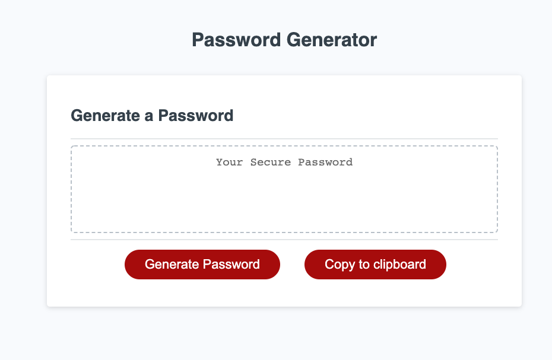

# Password Generator
By Mario Viana

Thi is the result of the combination of HTML, CSS And JavaScript.
## Mock-up

This program was made to run different types of passwords in a random way, it is very 
easy to use just press the red button on the left "generate password" and start asking 
some questions.

The first question is how many characters does your password need?

The program needs to know how many characters you want to put, so that it knows exactly 
how many characters from 8 to 128 you can assign to your password, that is, we have to 
give a number in the established range.

The following are questions to select which types of characters you can possibly put
in your password for the program to select at random of them.

After answering all the above questions, you can copy your password with the red button
on your right side and this will be done in a clipboard, You can use in best way.

## Thank you!!!
